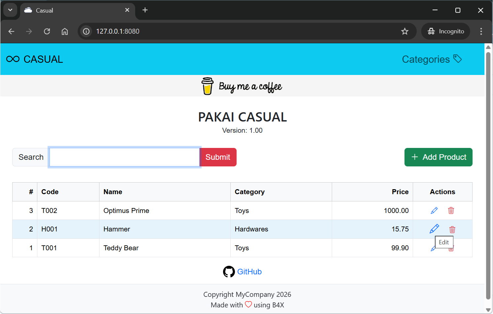

# pakai-casual-b4j

Version: 6.90

Basic web application template derived from Pakai Server

### Preview

---

## Templates
- Pakai Casual (6.90).b4xtemplate

## Depends on
- [EndsMeet.b4xlib](https://github.com/pyhoon/EndsMeet)
- ByteConverter (internal) - required by WebUtils
- jCore (internal)
- jSQL (internal)

### JDBC driver
- sqlite-jdbc-3.7.2.jar
- mysql-connector-j-9.3.0.jar
- mariadb-java-client-3.5.6.jar

## Features
- Use jSQL library to connect to SQLite and MySQL/MariaDB database
- Built-in simple inventory system with CRUD functionality
- Responsive design front-end with modal dialog and toast based on HTMX v2.0.8, AlpineJS v3.15.8, Bootstrap v5.3.8, Bootstrap Icons v1.13.1
- Easy to extend or replace with your own HTML template
